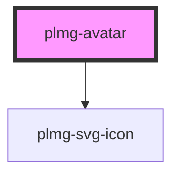

# plmg-avatar

<!-- Auto Generated Below -->

## Properties

| Property            | Attribute          | Description                                                                                                                                     | Type                                              | Default                            |
| ------------------- | ------------------ | ----------------------------------------------------------------------------------------------------------------------------------------------- | ------------------------------------------------- | ---------------------------------- |
| `backgroundColor`   | `background-color` | Define background color.  Can be any valid CSS color value.  Default is plmgColorBorderNeutralMedium.                                           | `string`                                          | `plmgColorBackgroundNeutralMedium` |
| `iconColor`         | `icon-color`       | Define icon color.  Can be any valid CSS color value.  Default is plmgColorIconNeutral                                                          | `string`                                          | `plmgColorIconNeutral`             |
| `imageUrl`          | `image-url`        | Define imageUrl  Allowed value: - Any string  If no image url is passed, default icon is displayed.                                             | `string`                                          | `undefined`                        |
| `interactive`       | `interactive`      | Define if avatar can be interacted with  Allowed values: - true - false  If false, the avatar displays an non-interactive image  Default: false | `boolean`                                         | `false`                            |
| `label`             | `label`            | An accessible label. If no label is supplied, the icon or image is hidden from assistive technology.                                            | `string`                                          | `undefined`                        |
| `size` _(required)_ | `size`             | Define size  Allowed values: - small - medium - large - extra-large  Required                                                                   | `"extra-large" \| "large" \| "medium" \| "small"` | `undefined`                        |
| `userDeleted`       | `user-deleted`     | Define userDeleted  Displays the deleted user icon  Allowed values: - true - false  Default: false                                              | `boolean`                                         | `false`                            |

## Events

| Event         | Description                                                         | Type                      |
| ------------- | ------------------------------------------------------------------- | ------------------------- |
| `avatarClick` | Exposes click handler event. Only exposed when interactive is true. | `CustomEvent<MouseEvent>` |

## Dependencies

### Depends on

- [plmg-svg-icon](../plmg-svg-icon)

### Graph

----------------------------------------------

*Built with [StencilJS](https://stenciljs.com/)*
