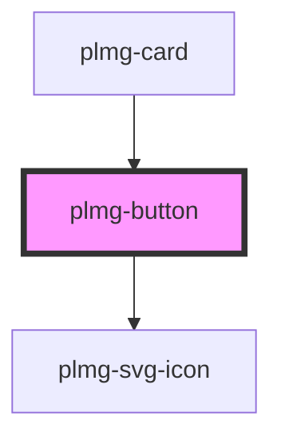

# plmg-button

<!-- Auto Generated Below -->

## Properties

| Property     | Attribute     | Description                                                                                                                                                                                                                                                                                                                                                                                                                                                                 | Type                                                                         | Default     |
| ------------ | ------------- | --------------------------------------------------------------------------------------------------------------------------------------------------------------------------------------------------------------------------------------------------------------------------------------------------------------------------------------------------------------------------------------------------------------------------------------------------------------------------- | ---------------------------------------------------------------------------- | ----------- |
| `color`      | `color`       | Define button's color  Allowed values:   - primary   - neutral   - standout   - danger  Default: primary                                                                                                                                                                                                                                                                                                                                                                    | `"danger" \| "neutral" \| "primary" \| "standout"`                           | `'primary'` |
| `design`     | `design`      | Define button's design.  Allowed values:   - filled   - filled-round   - outline   - outline-round   - borderless  Default: filled                                                                                                                                                                                                                                                                                                                                          | `"borderless" \| "filled" \| "filled-round" \| "outline" \| "outline-round"` | `'filled'`  |
| `fullWidth`  | `full-width`  | Define button's width  Allowed values:   - true   - false  Default: false                                                                                                                                                                                                                                                                                                                                                                                                   | `boolean`                                                                    | `false`     |
| `href`       | `href`        | Define button as a link                                                                                                                                                                                                                                                                                                                                                                                                                                                     | `string`                                                                     | `undefined` |
| `iconCenter` | `icon-center` | Define button's centered icon.  When providing an icon name to this prop, the corresponding icon will be displayed. it will be placed to the center.  You must provide a label.  When providing a center icon, you should not provide a text slot. That is because the center icon will be bigger than the text, to render with the same height as other buttons. If you do provide both the center icon and the text slot, the icon will appear just before the text slot. | `string`                                                                     | `undefined` |
| `iconLeft`   | `icon-left`   | Define button's left icon.  When providing an icon name to this prop, the corresponding icon will be displayed. it will be placed to the left of the text slot.                                                                                                                                                                                                                                                                                                             | `string`                                                                     | `undefined` |
| `iconRight`  | `icon-right`  | Define button's right icon.  When providing an icon name to this prop, the corresponding icon will be displayed. it will be placed to the right of the text slot.                                                                                                                                                                                                                                                                                                           | `string`                                                                     | `undefined` |
| `label`      | `label`       | An accessible label for the Icon Button. If no label is supplied, the icon is hidden from assistive technology.  You must provide this when providing iconCenter.                                                                                                                                                                                                                                                                                                           | `string`                                                                     | `undefined` |
| `rel`        | `rel`         | Define links rel                                                                                                                                                                                                                                                                                                                                                                                                                                                            | `string`                                                                     | `undefined` |
| `shadow`     | `shadow`      | Define button's shadow  Allowed values:   - true   - false  Default: false                                                                                                                                                                                                                                                                                                                                                                                                  | `boolean`                                                                    | `false`     |
| `size`       | `size`        | Define button's size  Allowed values:   - small   - medium   - large   - extra-large  Default: medium                                                                                                                                                                                                                                                                                                                                                                       | `"extra-large" \| "large" \| "medium" \| "small"`                            | `'medium'`  |
| `target`     | `target`      | Define links target                                                                                                                                                                                                                                                                                                                                                                                                                                                         | `string`                                                                     | `undefined` |
| `type`       | `type`        | Define button's type  Allowed values:   - button   - submit   - reset  Default: button                                                                                                                                                                                                                                                                                                                                                                                      | `"button" \| "reset" \| "submit"`                                            | `'button'`  |

## Slots

| Slot        | Description                |
| ----------- | -------------------------- |
| `"default"` | Text content of the button |

## Dependencies

### Used by

 - [plmg-card](../plmg-card)

### Depends on

- [plmg-svg-icon](../plmg-svg-icon)

### Graph

----------------------------------------------

*Built with [StencilJS](https://stenciljs.com/)*
