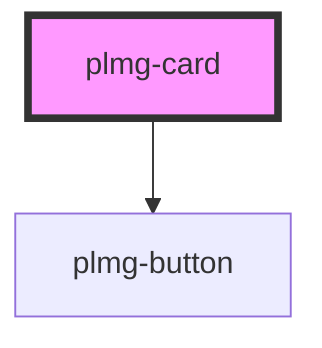

# plmg-card

<!-- Auto Generated Below -->

## Properties

| Property           | Attribute            | Description                                                                                                                                                                                                                             | Type     | Default     |
| ------------------ | -------------------- | --------------------------------------------------------------------------------------------------------------------------------------------------------------------------------------------------------------------------------------- | -------- | ----------- |
| `bottomActionText` | `bottom-action-text` | Define card's bottom button text.  If a text is provided, the button will be displayed. By default, when no text is provided, the button is hidden.                                                                                     | `string` | `undefined` |
| `headerText`       | `header-text`        | Define card's header text.  If a text or an icon is provided, the heading will be displayed. By default, when no text nor icon is provided, the heading is hidden.                                                                      | `string` | `undefined` |
| `topActionIcon`    | `top-action-icon`    | Define card's header icon, used as a top action for the card.  If a text or an icon is provided, the heading will be displayed with the icon button on the right. By default, when no text nor icon is provided, the heading is hidden. | `string` | `undefined` |

## Events

| Event                 | Description                                                                            | Type                      |
| --------------------- | -------------------------------------------------------------------------------------- | ------------------------- |
| `bottomActionClicked` | The event "bottomActionClicked" is triggered when the bottom action button is clicked. | `CustomEvent<MouseEvent>` |
| `topActionClicked`    | The event "topActionClicked" is triggered when the top action button is clicked.       | `CustomEvent<MouseEvent>` |

## Slots

| Slot       | Description                                                                    |
| ---------- | ------------------------------------------------------------------------------ |
| `"slot-1"` | First slot for custom content.                                                 |
| `"slot-2"` | Second slot for custom content, separated from the first slot by a margin-top. |

## Dependencies

### Depends on

- [plmg-button](../plmg-button)

### Graph

----------------------------------------------

*Built with [StencilJS](https://stenciljs.com/)*
