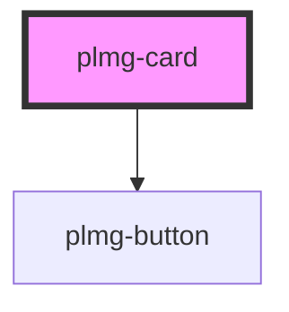

# plmg-card

<!-- Auto Generated Below -->

## Properties

| Property             | Attribute            | Description                        | Type         | Default     |
| -------------------- | -------------------- | ---------------------------------- | ------------ | ----------- |
| `bottomButtonAction` | --                   | Define card's bottom button action | `() => void` | `undefined` |
| `bottomButtonText`   | `bottom-button-text` | Define card's bottom button text   | `string`     | `undefined` |
| `headerText`         | `header-text`        | Define card's header text          | `string`     | `undefined` |

## Dependencies

### Depends on

- [plmg-button](../plmg-button)

### Graph

----------------------------------------------

*Built with [StencilJS](https://stenciljs.com/)*
