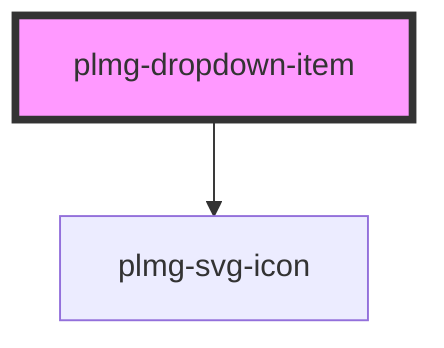

# plmg-dropdown-item

<!-- Auto Generated Below -->

## Properties

| Property | Attribute | Description                                                                                                                                                                                       | Type     | Default     |
| -------- | --------- | ------------------------------------------------------------------------------------------------------------------------------------------------------------------------------------------------- | -------- | ----------- |
| `href`   | `href`    | The link to redirect to when this item is clicked.                                                                                                                                                | `string` | `undefined` |
| `icon`   | `icon`    | Provide an optional icon to display to the left of the text.                                                                                                                                      | `string` | `undefined` |
| `rel`    | `rel`     | Define links rel                                                                                                                                                                                  | `string` | `undefined` |
| `target` | `target`  | Define links target                                                                                                                                                                               | `string` | `undefined` |
| `text`   | `text`    | The text to show on the item. it is mandatory to provide a text.  If the text is too long for the item, it will be truncated and will end with "...". Example: "This name is too lon..."          | `string` | `undefined` |
| `width`  | `width`   | Define width  Allowed values: - Any positive number  Override the default width of the text input field with a pixel value  Maximum width is 320px  By default the width is set by content length | `number` | `undefined` |

## Dependencies

### Depends on

- [plmg-svg-icon](../plmg-svg-icon)

### Graph

----------------------------------------------

*Built with [StencilJS](https://stenciljs.com/)*
