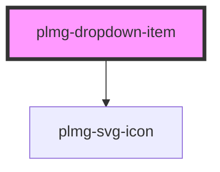

# plmg-dropdown-item

<!-- Auto Generated Below -->

## Properties

| Property   | Attribute  | Description                                                                                                                                                          | Type      | Default     |
| ---------- | ---------- | -------------------------------------------------------------------------------------------------------------------------------------------------------------------- | --------- | ----------- |
| `href`     | `href`     | Define href attribute of the anchor element.                                                                                                                         | `string`  | `undefined` |
| `icon`     | `icon`     | Provide an optional icon to display to the left of the text                                                                                                          | `string`  | `undefined` |
| `rel`      | `rel`      | Define links rel                                                                                                                                                     | `string`  | `undefined` |
| `selected` | `selected` | Set the dropdown item as selected.                                                                                                                                   | `boolean` | `undefined` |
| `target`   | `target`   | Define links target                                                                                                                                                  | `string`  | `undefined` |
| `text`     | `text`     | The text to show on the item.  If the text is too long for the item, it will be truncated and will end with "...". Example: "A very long text that will be trunc..." | `string`  | `undefined` |

## Dependencies

### Depends on

- [plmg-svg-icon](../plmg-svg-icon)

### Graph

----------------------------------------------

*Built with [StencilJS](https://stenciljs.com/)*
