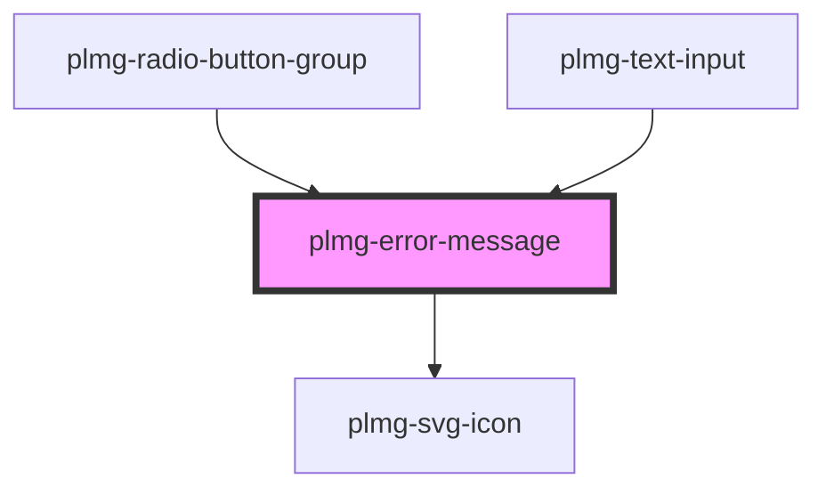

# plmg-error-message

<!-- Auto Generated Below -->

## Properties

| Property  | Attribute | Description                                                                        | Type                  | Default     |
| --------- | --------- | ---------------------------------------------------------------------------------- | --------------------- | ----------- |
| `message` | `message` | Define error message's message                                                     | `string`              | `undefined` |
| `size`    | `size`    | Define error message's size  Allowed values:   - medium   - large  Default: medium | `"large" \| "medium"` | `'medium'`  |

## Dependencies

### Used by

 - [plmg-radio-button-group](../plmg-radio-button-group)
 - [plmg-text-input](../plmg-text-input)

### Depends on

- [plmg-svg-icon](../plmg-svg-icon)

### Graph

----------------------------------------------

*Built with [StencilJS](https://stenciljs.com/)*
