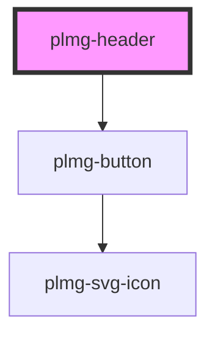

# plmg-header

<!-- Auto Generated Below -->

## Events

| Event           | Description                                                        | Type               |
| --------------- | ------------------------------------------------------------------ | ------------------ |
| `expandSidebar` | Event dispatched when the button to expand the sidebar is clicked. | `CustomEvent<any>` |

## Dependencies

### Depends on

- [plmg-button](../plmg-button)

### Graph

----------------------------------------------

*Built with [StencilJS](https://stenciljs.com/)*
