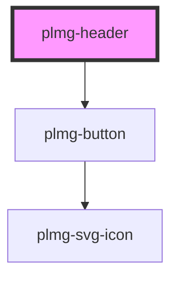

# plmg-header

<!-- Auto Generated Below -->

## Overview

Header sitting on top of the page.
Reveals the Sidebar when clicking the expand button (therefore, you must add PlmgSidebar as well).
This header must be wrapped inside a PlmgPageContainer, on the "header" slot.

Note: only a single instance of PlmgHeader is allowed on a web page.

## Properties

| Property          | Attribute          | Description                                   | Type      | Default |
| ----------------- | ------------------ | --------------------------------------------- | --------- | ------- |
| `sidebarExpanded` | `sidebar-expanded` | Define if the sidebar is expanded on startup. | `boolean` | `false` |

## Events

| Event           | Description                                                        | Type                |
| --------------- | ------------------------------------------------------------------ | ------------------- |
| `expandSidebar` | Event dispatched when the button to expand the sidebar is clicked. | `CustomEvent<void>` |

## Methods

### `sidebarCollapsedHandler() => Promise<void>`

Invoke this method to reveals the "expand" icon and update the margin left

#### Returns

Type: `Promise<void>`

## Slots

| Slot      | Description                   |
| --------- | ----------------------------- |
| `"left"`  | Content floating to the left  |
| `"right"` | Content floating to the right |

## Dependencies

### Depends on

- [plmg-button](../plmg-button)

### Graph

----------------------------------------------

*Built with [StencilJS](https://stenciljs.com/)*
