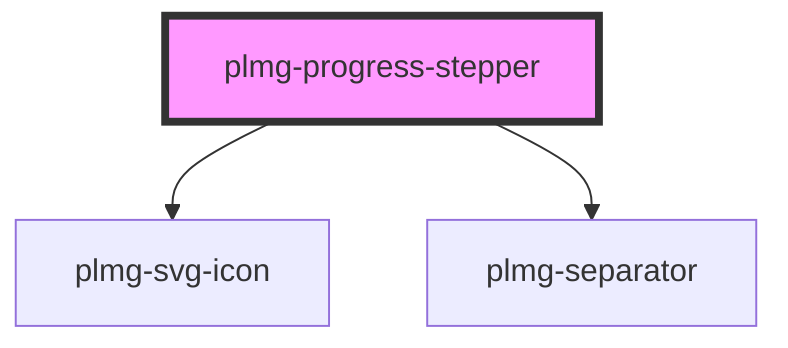

# plmg-progress-stepper

<!-- Auto Generated Below -->

## Properties

| Property      | Attribute     | Description                                                                | Type      | Default     |
| ------------- | ------------- | -------------------------------------------------------------------------- | --------- | ----------- |
| `active`      | `active`      | Define active state  Default: false                                        | `boolean` | `false`     |
| `completed`   | `completed`   | Define completed state  Default: false  Not completed is the default state | `boolean` | `false`     |
| `description` | `description` | Define a description text for the stepper                                  | `string`  | `undefined` |
| `disabled`    | `disabled`    | Define disabled state  Default: true                                       | `boolean` | `false`     |
| `stepNumber`  | `step-number` | Define completed state  Default: false                                     | `number`  | `undefined` |

## Dependencies

### Depends on

- [plmg-svg-icon](../plmg-svg-icon)
- [plmg-separator](../plmg-separator)

### Graph

----------------------------------------------

*Built with [StencilJS](https://stenciljs.com/)*
