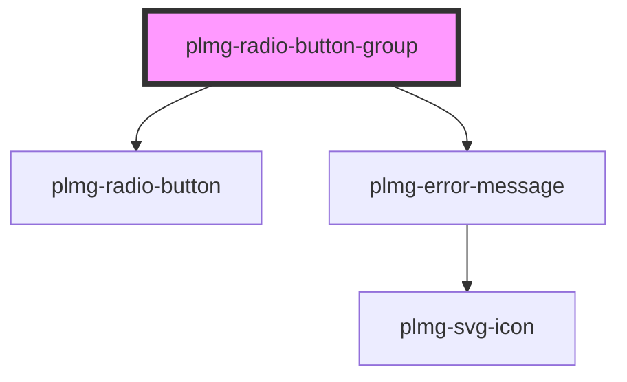

# plmg-radio-button-group

<!-- Auto Generated Below -->

## Properties

| Property       | Attribute       | Description                                                                                                                                                                            | Type                  | Default     |
| -------------- | --------------- | -------------------------------------------------------------------------------------------------------------------------------------------------------------------------------------- | --------------------- | ----------- |
| `errorMessage` | `error-message` | Define error message for radio group to be displayed if form validation fails  Will render one error message for the radio button group, affects styling of all radio buttons in group | `string`              | `undefined` |
| `label`        | `label`         | Define text for the form's label                                                                                                                                                       | `string`              | `undefined` |
| `name`         | `name`          | Define form's name, used to group all radio buttons within together                                                                                                                    | `string`              | `undefined` |
| `required`     | `required`      | Define radio group's required status  Allowed values:   - true   - false  Default: false                                                                                               | `boolean`             | `false`     |
| `size`         | `size`          | Define size of all radio button's in radio button group.  Allowed values:   - medium   - large  Default: medium                                                                        | `"large" \| "medium"` | `'medium'`  |
| `values`       | `values`        | Define each radio button's value  Accepts an array or JSON string                                                                                                                      | `string \| string[]`  | `undefined` |

## Events

| Event          | Description                                          | Type                                      |
| -------------- | ---------------------------------------------------- | ----------------------------------------- |
| `valueChanged` | Event emitted when the selected radio button changed | `CustomEvent<{ selectedValue: string; }>` |

## Dependencies

### Depends on

- [plmg-radio-button](../plmg-radio-button)
- [plmg-error-message](../plmg-error-message)

### Graph

----------------------------------------------

*Built with [StencilJS](https://stenciljs.com/)*
