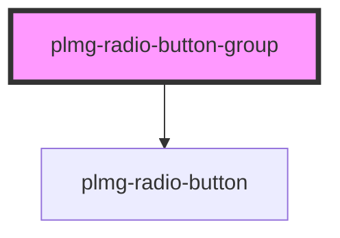

# plmg-radio-button-group

<!-- Auto Generated Below -->

## Properties

| Property   | Attribute  | Description                                                                              | Type      | Default     |
| ---------- | ---------- | ---------------------------------------------------------------------------------------- | --------- | ----------- |
| `label`    | `label`    | Define form's label'                                                                     | `string`  | `undefined` |
| `name`     | `name`     | Define form's name'                                                                      | `string`  | `undefined` |
| `required` | `required` | Define radio group's required status  Allowed values:   - true   - false  Default: false | `boolean` | `false`     |
| `values`   | `values`   |                                                                                          | `string`  | `undefined` |

## Dependencies

### Depends on

- [plmg-radio-button](../plmg-radio-button)

### Graph

----------------------------------------------

*Built with [StencilJS](https://stenciljs.com/)*
