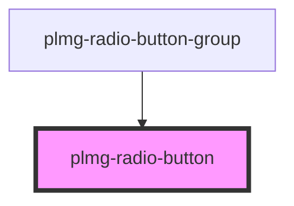

# plmg-radio-button

<!-- Auto Generated Below -->

## Properties

| Property      | Attribute     | Description                                                                                                     | Type                       | Default     |
| ------------- | ------------- | --------------------------------------------------------------------------------------------------------------- | -------------------------- | ----------- |
| `highlighted` | `highlighted` | Define radio button's highlighted status (in case of error)  Allowed values:   - true   - false  Default: false | `boolean`                  | `false`     |
| `isValid`     | --            | Callback to provide validity of radio input to radio button group                                               | `(valid: boolean) => void` | `undefined` |
| `name`        | `name`        | Define form's name'                                                                                             | `string`                   | `undefined` |
| `required`    | `required`    | Define radio button's required status  Allowed values:   - true   - false  Default: false                       | `boolean`                  | `false`     |
| `selected`    | `selected`    | Define radio button's checked status  Allowed values:   - true   - false  Default: false                        | `boolean`                  | `false`     |
| `size`        | `size`        | Define radio button's size.  Allowed values:   - medium   - large  Default: medium                              | `"large" \| "medium"`      | `'medium'`  |
| `value`       | `value`       | Define radio button's value'                                                                                    | `string`                   | `undefined` |

## Dependencies

### Used by

 - [plmg-radio-button-group](../plmg-radio-button-group)

### Graph

----------------------------------------------

*Built with [StencilJS](https://stenciljs.com/)*
