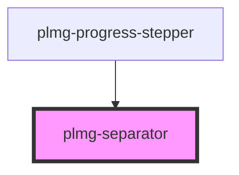

# plmg-separator

<!-- Auto Generated Below -->

## Properties

| Property    | Attribute   | Description                                                                                     | Type     | Default                  |
| ----------- | ----------- | ----------------------------------------------------------------------------------------------- | -------- | ------------------------ |
| `color`     | `color`     | Define separator's color.  Can be any valid CSS color value.  Default is plmgColorBorderNeutral | `string` | `plmgColorBorderNeutral` |
| `direction` | `direction` | Define separator's direction.  Allowed values:   - vertical   - horizontal  Default: horizontal | `string` | `'horizontal'`           |
| `thickness` | `thickness` | Define separator's thickness.  Allowed values:   - thin   - thick  Default: thin                | `string` | `'thin'`                 |

## Dependencies

### Used by

 - [plmg-progress-stepper](../plmg-progress-stepper)

### Graph

----------------------------------------------

*Built with [StencilJS](https://stenciljs.com/)*
