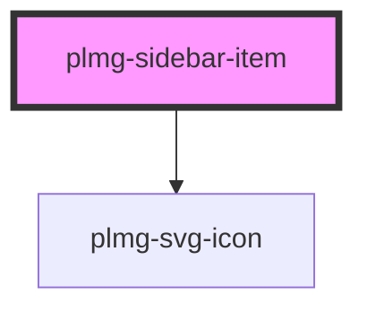

# plmg-sidebar-item

<!-- Auto Generated Below -->

## Properties

| Property   | Attribute  | Description                                                                                                                                                                                        | Type      | Default     |
| ---------- | ---------- | -------------------------------------------------------------------------------------------------------------------------------------------------------------------------------------------------- | --------- | ----------- |
| `active`   | `active`   | Set this prop to True when this item is active. It highlights the item.                                                                                                                            | `boolean` | `false`     |
| `expanded` | `expanded` | Define if the item is expanded. Only valid when this item has children.                                                                                                                            | `boolean` | `false`     |
| `href`     | `href`     | The link to redirect to when this item is clicked.  If this item has children, you cannot provide a href, because clicking the item will instead expand/collapse the children list.                | `string`  | `undefined` |
| `icon`     | `icon`     | The name of the icon to show on the left of the text. It is optional to provide an icon.  Items at level 2 should never have an icon. Icon will not be rendered even if provided.                  | `string`  | `undefined` |
| `level`    | `level`    | The level of the item. You must provide the level of the item.  Level 1 is for root items. They can have an icon and sub-items. Level 2 is for leaf items. They cannot have an icon nor sub-items. | `1 \| 2`  | `1`         |
| `rel`      | `rel`      | Define links rel                                                                                                                                                                                   | `string`  | `undefined` |
| `target`   | `target`   | Define links target                                                                                                                                                                                | `string`  | `undefined` |
| `text`     | `text`     | The text to show on the item. it is mandatory to provide a text.  If the text is too long for the item, it will be truncated and will end with "...". Example: "This name is too lon..."           | `string`  | `undefined` |

## Dependencies

### Depends on

- [plmg-svg-icon](../plmg-svg-icon)

### Graph

----------------------------------------------

*Built with [StencilJS](https://stenciljs.com/)*
