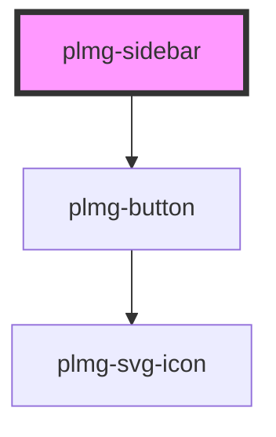

# plmg-sidebar

<!-- Auto Generated Below -->

## Properties

| Property   | Attribute  | Description                     | Type      | Default |
| ---------- | ---------- | ------------------------------- | --------- | ------- |
| `expanded` | `expanded` | Define if the item is expanded. | `boolean` | `false` |
| `logoSrc`  | `logo-src` | "src" property of the logo img  | `string`  | `''`    |

## Events

| Event             | Description                                                          | Type               |
| ----------------- | -------------------------------------------------------------------- | ------------------ |
| `collapseSidebar` | Event dispatched when the button to collapse the sidebar is clicked. | `CustomEvent<any>` |

## Methods

### `expand() => Promise<void>`

Invoke this method to expand the sidebar.

#### Returns

Type: `Promise<void>`

## Slots

| Slot        | Description                                           |
| ----------- | ----------------------------------------------------- |
| `"default"` | Add one or more PlmgSidebarItem to this default slot. |

## Dependencies

### Depends on

- [plmg-button](../plmg-button)

### Graph

----------------------------------------------

*Built with [StencilJS](https://stenciljs.com/)*
