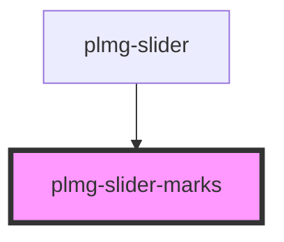

# plmg-slider-marks

<!-- Auto Generated Below -->

## Properties

| Property | Attribute | Description | Type       | Default     |
| -------- | --------- | ----------- | ---------- | ----------- |
| `marks`  | `marks`   |             | `boolean`  | `true`      |
| `max`    | `max`     |             | `number`   | `undefined` |
| `min`    | `min`     |             | `number`   | `undefined` |
| `name`   | `name`    |             | `string`   | `undefined` |
| `range`  | --        |             | `number[]` | `undefined` |
| `value`  | `value`   |             | `number`   | `undefined` |
| `width`  | `width`   |             | `number`   | `undefined` |

## Dependencies

### Used by

 - [plmg-slider](../plmg-slider)

### Graph

----------------------------------------------

*Built with [StencilJS](https://stenciljs.com/)*
