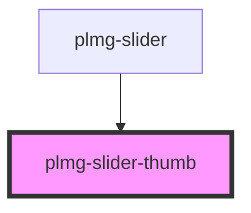

# plmg-slider-thumb

<!-- Auto Generated Below -->

## Properties

| Property               | Attribute                | Description | Type      | Default     |
| ---------------------- | ------------------------ | ----------- | --------- | ----------- |
| `calculatedThumbWidth` | `calculated-thumb-width` |             | `number`  | `undefined` |
| `max`                  | `max`                    |             | `number`  | `undefined` |
| `min`                  | `min`                    |             | `number`  | `undefined` |
| `name`                 | `name`                   |             | `string`  | `undefined` |
| `thumbLabel`           | `thumb-label`            |             | `boolean` | `true`      |
| `value`                | `value`                  |             | `number`  | `undefined` |
| `width`                | `width`                  |             | `number`  | `undefined` |

## Dependencies

### Used by

 - [plmg-slider](../plmg-slider)

### Graph

----------------------------------------------

*Built with [StencilJS](https://stenciljs.com/)*
