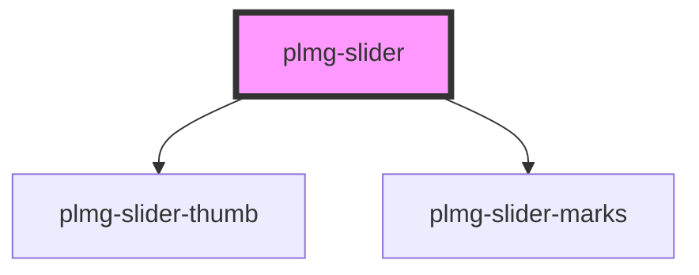

# plmg-slider

<!-- Auto Generated Below -->

## Properties

| Property       | Attribute       | Description                                                                                                                                                                                               | Type       | Default     |
| -------------- | --------------- | --------------------------------------------------------------------------------------------------------------------------------------------------------------------------------------------------------- | ---------- | ----------- |
| `defaultValue` | `default-value` | Define the default value.  Sets the starting value for the slider.  Allowed: Any number  When the default value is outside of the min and max values or undefined, default value is set to the min value. | `number`   | `undefined` |
| `inputId`      | `input-id`      | Define an id attribute for the input  Any string                                                                                                                                                          | `string`   | `undefined` |
| `marks`        | `marks`         | Define if marks and marks labels are visible  Default: true                                                                                                                                               | `boolean`  | `true`      |
| `name`         | `name`          | Define a name for the slider  Any string                                                                                                                                                                  | `string`   | `undefined` |
| `rangeValues`  | --              | Define the range of values  Must be a list of values with at least two items  First and last items set min and max values  Additional values set mark additional labels  Required                         | `number[]` | `undefined` |
| `step`         | `step`          | Define step  Slider's value will increase or decrease in stepValue  Allowed values - Any number  When step is not provided step, step is set to 1% of the range                                           | `number`   | `undefined` |
| `thumbLabel`   | `thumb-label`   | Define thumb label visibility  Allowed values  - true  - false  Default: true                                                                                                                             | `boolean`  | `true`      |

## Events

| Event          | Description | Type               |
| -------------- | ----------- | ------------------ |
| `valueUpdated` |             | `CustomEvent<any>` |

## Dependencies

### Depends on

- [plmg-slider-thumb](../plmg-slider-thumb)
- [plmg-slider-marks](../plmg-slider-marks)

### Graph

----------------------------------------------

*Built with [StencilJS](https://stenciljs.com/)*
