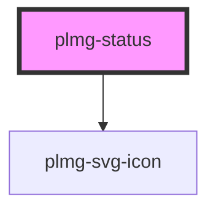

# plmg-status

<!-- Auto Generated Below -->

## Properties

| Property               | Attribute    | Description                                                                                                                                                       | Type                                                        | Default     |
| ---------------------- | ------------ | ----------------------------------------------------------------------------------------------------------------------------------------------------------------- | ----------------------------------------------------------- | ----------- |
| `iconLeft`             | `icon-left`  | Define status's left icon.  When providing an icon name to this prop, the corresponding icon will be displayed. it will be placed to the left of the text slot.   | `string`                                                    | `undefined` |
| `iconRight`            | `icon-right` | Define status's right icon.  When providing an icon name to this prop, the corresponding icon will be displayed. it will be placed to the right of the text slot. | `string`                                                    | `undefined` |
| `variant` _(required)_ | `variant`    | Define status variant  Allowed values:   - neutral   - danger   - info   - warning   - success  Sets background and text colors  required                         | `"danger" \| "info" \| "neutral" \| "success" \| "warning"` | `undefined` |

## Dependencies

### Depends on

- [plmg-svg-icon](../plmg-svg-icon)

### Graph

----------------------------------------------

*Built with [StencilJS](https://stenciljs.com/)*
