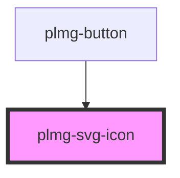

# plmg-svg-icon

<!-- Auto Generated Below -->

## Properties

| Property | Attribute | Description                                                                                                                                           | Type     | Default     |
| -------- | --------- | ----------------------------------------------------------------------------------------------------------------------------------------------------- | -------- | ----------- |
| `color`  | `color`   | Define icon's color.  Can be any valid CSS color value.  By default, the icon will have the same color as the parent's element.                       | `string` | `undefined` |
| `icon`   | `icon`    | Define icon by its name. Name must be one of the existing icon: https://components.ducky.eco/?path=/story/component-svgicon--all-icons  Default: NULL | `string` | `null`      |
| `size`   | `size`    | Define the icon's size.  Allowed values: <value><unit>  Examples: - 1em - 42px  Default: 1em                                                          | `string` | `'1em'`     |

## Dependencies

### Used by

 - [plmg-button](../plmg-button)

### Graph

----------------------------------------------

*Built with [StencilJS](https://stenciljs.com/)*
