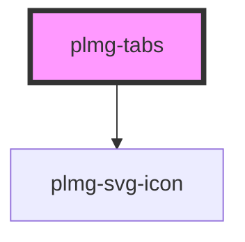

# plmg-tabs

<!-- Auto Generated Below -->

## Events

| Event       | Description                                                         | Type               |
| ----------- | ------------------------------------------------------------------- | ------------------ |
| `tabChange` | Event tabChange is emitted for onChange events when switching tabs. | `CustomEvent<any>` |

## Methods

### `openTab(index: number) => Promise<void>`

Invoke this method on tab change to update active state and emit onChange handler.

#### Returns

Type: `Promise<void>`

## Dependencies

### Depends on

- [plmg-svg-icon](../plmg-svg-icon)

### Graph

----------------------------------------------

*Built with [StencilJS](https://stenciljs.com/)*
