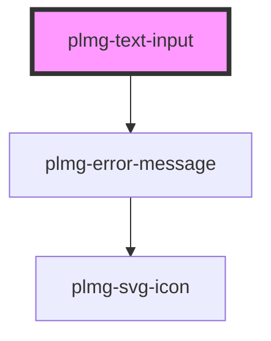

# plmg-text-input

<!-- Auto Generated Below -->

## Properties

| Property             | Attribute       | Description                                                                                                                                          | Type                  | Default     |
| -------------------- | --------------- | ---------------------------------------------------------------------------------------------------------------------------------------------------- | --------------------- | ----------- |
| `disabled`           | `disabled`      | Define disabled  Allowed value: boolean  Disables text input                                                                                         | `boolean`             | `false`     |
| `errorMessage`       | `error-message` | Define error message  Allowed value: any string  Sets error style and error message                                                                  | `string`              | `undefined` |
| `label` _(required)_ | `label`         | Define a label name for the input field.  Allowed values: - Any string  A unique label name for each element in a form is required for accessibility | `string`              | `undefined` |
| `readOnly`           | `read-only`     | Define readonly  Allowed value: boolean  Makes text input read only                                                                                  | `boolean`             | `false`     |
| `required`           | `required`      | Define if an input is required.  Allowed values: - true - false  Default: false                                                                      | `boolean`             | `false`     |
| `showLabel`          | `show-label`    | Define if the label is shown  Allowed values: - true - false  Default: true                                                                          | `boolean`             | `true`      |
| `size`               | `size`          |  Define text input's size  Allowed values:   - medium   - large  Default: medium                                                                     | `"large" \| "medium"` | `'medium'`  |
| `tip`                | `tip`           | Define tip  Allowed value: any string  Displays a tip message                                                                                        | `string`              | `undefined` |
| `value`              | `value`         | Control the text input's value  Allowed values: - Any string  Sets the value of the text input                                                       | `string`              | `undefined` |

## Events

| Event          | Description                      | Type               |
| -------------- | -------------------------------- | ------------------ |
| `valueUpdated` | Event emitted when value changed | `CustomEvent<any>` |

## Dependencies

### Depends on

- [plmg-error-message](../plmg-error-message)

### Graph

----------------------------------------------

*Built with [StencilJS](https://stenciljs.com/)*
