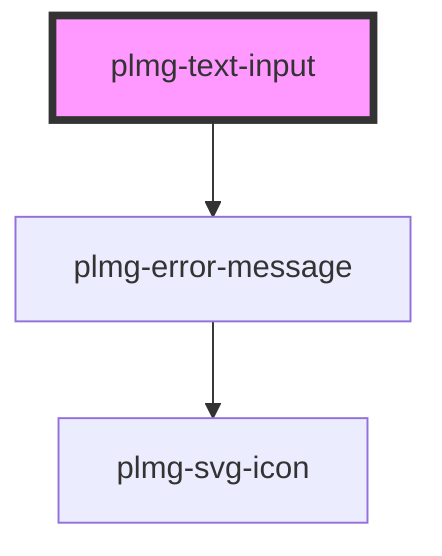

# plmg-text-input

<!-- Auto Generated Below -->

## Properties

| Property             | Attribute       | Description                                                                                                                                                                | Type                                                                        | Default     |
| -------------------- | --------------- | -------------------------------------------------------------------------------------------------------------------------------------------------------------------------- | --------------------------------------------------------------------------- | ----------- |
| `autoComplete`       | `auto-complete` | Define autocomplete  Allowed value: any string  Default: off                                                                                                               | `string`                                                                    | `'off'`     |
| `disabled`           | `disabled`      | Define disabled  Allowed value: boolean  Disables text input                                                                                                               | `boolean`                                                                   | `false`     |
| `errorMessage`       | `error-message` | Define error message  Allowed value: any string  Sets error style and error message                                                                                        | `string`                                                                    | `undefined` |
| `label` _(required)_ | `label`         | Define a label for the input field.  Allowed values: - Any string  A unique label for each element in a form is required for accessibility                                 | `string`                                                                    | `undefined` |
| `max`                | `max`           | Define the maximum value when type is number  Allowed values: - Any number  Only vaiid for type: number  Default: none                                                     | `number`                                                                    | `undefined` |
| `maxLength`          | `max-length`    | Define the maximum character length  Allowed values: - Any number  Only valid for types: text, search, url, tel, email, and password  Default: none                        | `number`                                                                    | `undefined` |
| `min`                | `min`           | Define the min value when type is number  Allowed values: - Any number  Only vaiid for type: number                                                                        | `number`                                                                    | `undefined` |
| `minLength`          | `min-length`    | Define the mininum character length  Allowed values: - Any number  Only valid for types: text, search, url, tel, email, and password  Default: none                        | `number`                                                                    | `undefined` |
| `name`               | `name`          | Define a name for the input field.  Allowed values: - Any string  Provide each input element with a unique name                                                            | `string`                                                                    | `undefined` |
| `pattern`            | `pattern`       | Define a regular expression pattern for constraint validation  Allowed value: any string  Only valid for types: text, search, url, tel, email, and password  Default: none | `string`                                                                    | `undefined` |
| `placeholder`        | `placeholder`   | Define a placeholder text  Allowed value: any string  Placeholder does not set a value.  Default: none                                                                     | `string`                                                                    | `undefined` |
| `readOnly`           | `read-only`     | Define readonly  Allowed value: boolean  Makes text input read only  Default: false                                                                                        | `boolean`                                                                   | `false`     |
| `required`           | `required`      | Define if an input is required.  Allowed values: - true - false  Default: false                                                                                            | `boolean`                                                                   | `false`     |
| `showLabel`          | `show-label`    | Define if the label is shown  Allowed values: - true - false  Default: true                                                                                                | `boolean`                                                                   | `true`      |
| `size`               | `size`          |  Define text input's size  Allowed values:   - medium   - large  Default: medium                                                                                           | `"large" \| "medium"`                                                       | `'medium'`  |
| `step`               | `step`          | Define the step value when type is number.  Allowed values: - Any number  Only vaiid for type: number  Default: 1                                                          | `number`                                                                    | `undefined` |
| `tip`                | `tip`           | Define tip  Allowed value: any string  Displays a tip message                                                                                                              | `string`                                                                    | `undefined` |
| `type`               | `type`          | Define type  Allowed values: -text -email -password -tel -url -search -number  Set the type of the input field  Default: text                                              | `"email" \| "number" \| "password" \| "search" \| "tel" \| "text" \| "url"` | `'text'`    |
| `value`              | `value`         | Control the text input's value  Allowed values: - Any string  Sets the value of the text input                                                                             | `string`                                                                    | `undefined` |
| `width`              | `width`         | Define width  Allowed values: - Any positive number greater than 0  Sets the width of the text input, by default width is set to 100% of the parent container              | `number`                                                                    | `undefined` |

## Events

| Event          | Description                                                                                                                                                                                    | Type                                                            |
| -------------- | ---------------------------------------------------------------------------------------------------------------------------------------------------------------------------------------------- | --------------------------------------------------------------- |
| `valueUpdated` | Event emitted when value changed. Event emitted is an object with the following properties: - value: value of the input - validityState: object containing constraint validityState properties | `CustomEvent<{ value: string; validityState: ValidityState; }>` |

## Dependencies

### Depends on

- [plmg-error-message](../plmg-error-message)

### Graph

----------------------------------------------

*Built with [StencilJS](https://stenciljs.com/)*
