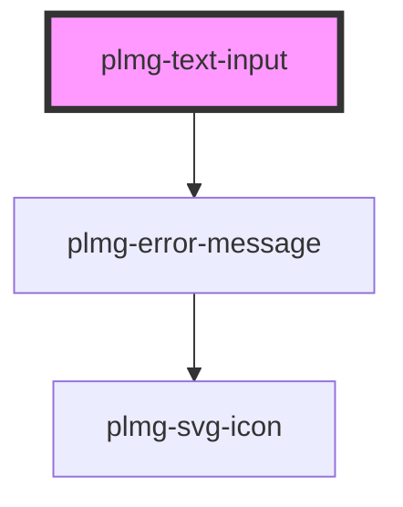

# plmg-text-input

<!-- Auto Generated Below -->

## Properties

| Property       | Attribute       | Description                                                                                                                                          | Type                  | Default     |
| -------------- | --------------- | ---------------------------------------------------------------------------------------------------------------------------------------------------- | --------------------- | ----------- |
| `LabelVisible` | `label-visible` | Define if the label is visible  Allowed values: - true - false  Default: true                                                                        | `boolean`             | `true`      |
| `default`      | `default`       | Define default value  Allowed values - Any string                                                                                                    | `string`              | `undefined` |
| `error`        | `error`         | Toggle error state:  Allowed values: - true - false                                                                                                  | `boolean`             | `false`     |
| `errorMessage` | `error-message` | Define error message  Allowed value: any string  Displayed when text input state is in error                                                         | `string`              | `undefined` |
| `filled`       | `filled`        | Define if input value is pre-filled with default  Allowed values: - true - false  Default: false                                                     | `boolean`             | `false`     |
| `label`        | `label`         | Define a label name for the input field.  Allowed values: - Any string  A unique label name for each element in a form is required for accessibility | `string`              | `undefined` |
| `required`     | `required`      | Define if an input is required.  Allowed values: - true - false  Default: false                                                                      | `boolean`             | `false`     |
| `size`         | `size`          |  Define text input's size  Allowed values:   - medium   - large  Default: medium                                                                     | `"large" \| "medium"` | `'medium'`  |
| `tip`          | `tip`           | Define if tip text is displayed.  Allowed values: - true - false  Default: false                                                                     | `boolean`             | `false`     |
| `tipText`      | `tip-text`      | Define tip text  Allowed value: any string  Displayed when tip is true                                                                               | `string`              | `undefined` |

## Dependencies

### Depends on

- [plmg-error-message](../plmg-error-message)

### Graph

----------------------------------------------

*Built with [StencilJS](https://stenciljs.com/)*
